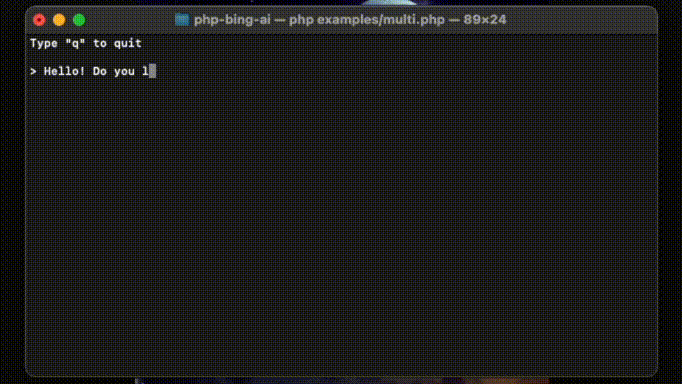

# Bing AI client

[](https://opensource.org/licenses/MIT)
[](https://packagist.org/packages/maximerenou/bing-ai)
[](https://packagist.org/packages/maximerenou/bing-ai)
[](https://packagist.org/packages/maximerenou/bing-ai)

This is an unofficial PHP client for **Bing AI**, including **Chat (GPT-4)** and **Image Creator (DALL-E)**.

## Installation

    composer require maximerenou/bing-ai

## Demo

This demo program uses both Chat and Image Creator:



Source: `examples/multi.php`.

## Usage

- [Chat AI](#chat-ai)
- [Image Creator AI](#image-creator)

First, you need to sign in on bing.com and get your `_U` cookie.

<details>
  <summary>How to get this cookie?</summary>

1. Navigate to bing.com
2. Sign in using your Microsoft account
3. Back on bing.com, right-click and select "Inspect" - the browser console appears
4. Go to "Application" tab
5. Select "Cookies" > "https://www.bing.com" in the sidebar
6. Search for "_U" cookie
7. Copy its content

</details> 

<details>
  <summary>How to check if my cookie is working properly?</summary>

```php
use MaximeRenou\BingAI\BingAI;

// $cookie - your "_U" cookie from bing.com
$ai = new BingAI($cookie);
$valid = $ai->checkCookie();
```

</details> 

---------------------------------------

### Chat AI

**Demo**: clone this repo, edit and run `examples/chat.php`.

```php
use MaximeRenou\BingAI\BingAI;
use MaximeRenou\BingAI\Chat\Prompt;

// $cookie - your "_U" cookie from bing.com
$ai = new BingAI($cookie);

$conversation = $ai->createChatConversation();

// $text - Text-only version of Bing's answer
// $cards - Message objects array
list($text, $cards) = $conversation->ask(new Prompt("Hello World"));
```

> `$cards` contains all "messages" exchanged with Bing AI. It can be text (prompt or answer), signals, suggestions, image generation requests, etc. Check `Message.php` to learn more 
about its format.

<details>
  <summary>Real-time / progressive answer</summary>

You may pass a function as second argument to get real-time progression:

```php
// $text - Incomplete text version
// $cards - Incomplete messages fleet
list($final_text, $final_cards) = $conversation->ask($prompt, function ($text, $cards) {
    echo $text;
});
```

</details> 

<details>
  <summary>Locale and location preferences</summary>

```php
$conversation = $ai->createChatConversation()
    ->withLocation($latitude, $longitude, $radius) // Optional
    ->withPreferences('fr-FR', 'fr-FR', 'FR'); // Optional
```

</details> 

<details>
  <summary>Tone choice</summary>

```php
use MaximeRenou\BingAI\Chat\Tone;

$conversation = $ai->createChatConversation()
    ->withTone(Tone::Creative); // Optional

// Choices:
// Tone::Balanced (default)
// Tone::Creative
// Tone::Precise
```

</details> 

<details>
  <summary>Resume a conversation</summary>  

If you want to resume a previous conversation, you can retrieve its identifiers:

```php
// Get current identifiers
$identifiers = $conversation->getIdentifiers();

// ...
// Resume conversation with $identifiers parameter, and number of previous questions asked
$conversation = $ai->resumeChatConversation($identifiers, 1);
```

</details> 

<details>
  <summary>Text generation</summary>

```php
$subject = "Internet memes";
$tone = 'funny';
$type = 'blog post';
$length = 'short';

$prompt = new Prompt("Please write a *$length* *$type* in a *$tone* style about `$subject`. Please wrap the $type in a markdown codeblock.");

$conversation->ask($prompt->withoutCache(), ...)
```

> To prevent answers like "I have already written \[...]", you can disable cache for your prompt with `withoutCache()`.

</details>

<details>
  <summary>Handle throttling  and kicks</summary>

Bing is limiting messages count per conversations. You can monitor it by calling `getRemainingMessages()` after every interaction.

```php
$remaining = $conversation->getRemainingMessages();

if ($remaining === 0) {
    // You reached the limit
}
```

After every interaction, you should also check if you have been kicked from the conversation:

```php
if ($conversation->kicked()) {
    // You have been kicked, you should start a new conversation
}
```

You may combine both checks with:

```php
if ($conversation->ended()) {
    // You reached the limit or have been kicked
}
```

</details>

---------------------------------------

### Image Creator

**Demo**: clone this repo, edit and run `examples/images.php`.

```php
use MaximeRenou\BingAI\BingAI;

// $cookie - your "_U" cookie from bing.com
$ai = new BingAI($cookie);

$creator = $ai->createImages("A 3D teddy bear");

$creator->wait();

// Finally, get images URLs
if (! $creator->hasFailed()) {
    $images = $creator->getImages();
}
```

> Image generation can become slower after consuming all of your "boosts". Check the section below to stay aware of your remaining boosts.

<details>
  <summary>Check remaining boosts</summary>

```php
$creator = $ai->getImageCreator();

$remaining_boosts = $creator->getRemainingBoosts();
```

</details>

<details>
  <summary>Asynchronous generation</summary>
You may quit after calling `createImages()` and check generation later using its ID:

```php
$prompt = "A 3D teddy bear";
$creator = $ai->createImages($prompt);
$generation_id = $creator->getGenerationId();

// ...

$creator = $ai->getImageCreator();
$creator->resume($generation_id, $prompt);
```

</details>

<details>
  <summary>Manually wait</summary>
Instead of calling `$creator->wait();` you can loop by yourself:

```php
do {
    sleep(1);
} while ($creator->isGenerating());
```

</details>

---------------------------------------

#### Disclaimer

Using Bing AI outside bing.com may violate Bing terms. Use it at your own risk.
Bing is a trademark of Microsoft.
